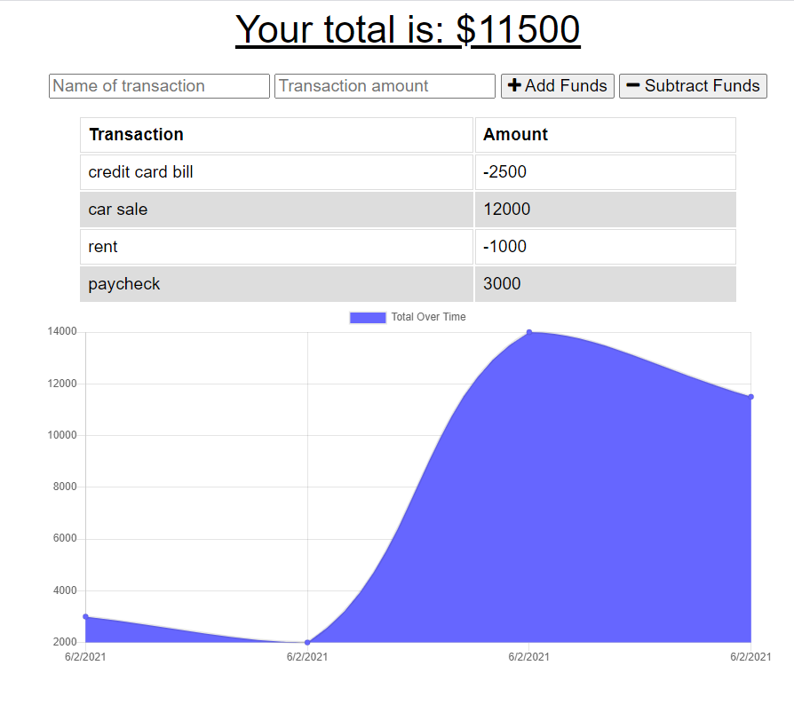

# Budget Tracker!

## Description

This application utilizes a Mongo database through a mongoose schema in order to create an easy-to-use tool that tracks your personal or professional finances. 
After inputing your monetary gains and/or expenditures, your budget data is stored and graphed for the user in a comprehensive but simple display.

### Technology Used

Node.js, Javascript, Mongoose, Express, MongoDB, IndexedDB

### Visuals

### Links

Github Repository: https://github.com/will98nicholson/budget-tracker

Heroku Deployment: https://cryptic-falls-36844.herokuapp.com/